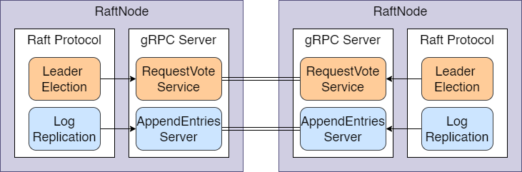
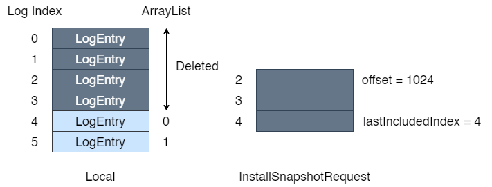
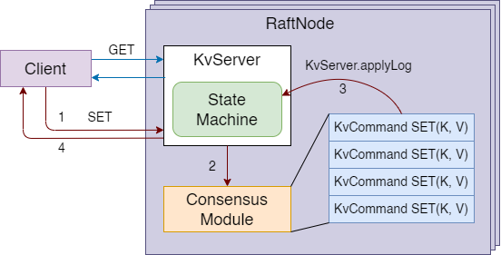

# Raft Key-Value Storage Lab

**WARNING:** This project is only intended as a functional verification experiment.

## 1 Raft

A process running Raft Protocol is represented by class `RaftNode`. Raft nodes communicate with each other through gRPC Protocol supported by `RaftRPCServer`.

> Implementation: RequestVote service and AppendEntries service uses RaftNode's state, so `RaftNode` and `RaftRPCServer` are circular referenced.

> TIPS: add ReentrantLock carefully in `RaftNode` and `KvServer`.

### 1.1 Leader Election

### 1.2 Log Replication

### 1.3 Log Compression and Snapshot

Each raft node may manage their own snapshot, which is irrelavent and thus is not implemented in the project. We only discuss how the leader sends its snapshot to followers.

Snapshot is managed by `Persister` in each `RaftNode`, and `RaftNode` itself does not known any details about the `Snapshot`.

There is a difference between logic log index and `ArrayList<LogEntry>`'s index. The logic log index is an increasing sequence, which may be inconsist with the array index after installing the snapshot and deleting the overdue log entries.

## 2 Key-Value Storage

`KvServer` is a replicated state machine. It does not handle client requests directly, but only applies logs recorded by consensus module.

Similar to `RaftRPCServer`, `KvServer` is a service registered to `RaftNode`, which may lead to a circular reference. The reason is when `RaftNode` calls `applyLogs` method, it has to learn how to update the replicated state machine in a specified service. In this case, `RaftNode.applyLogs` will call `KvServer.applyLog`.

### 2.1 Handle client requests

Client requests is sent to `KvServer` and processed by `RaftNode`. `RaftNode` regards the requests as logs. If the log is commited, the replicated state machine will apply the log later.

The `applyLog` method is called in two circumtance:
- when the followers process the `AppendEntriesRequest`
- when the leader receives a majority of response

`set` requests are responsed only at the leader node, and responsed successfully only if the leader applies the log.

`get` requests are read-only requests that can be responsed in any raft nodes. It does not trigger `AppendEntriesRequest`.

### 2.2 Return value to client

How can a client know if the request is executed successfully? A request fails in multiple situations:
- `KvServer`'s `RaftNode` is a follower
- Raft nodes do not reach a consensus

In the first situation, `KvServer` will get an immediantly `ok = false` tag, driving the client to resend the request. However, the second situation is more complicated. 

> Current solution is that the server calls `get` to check whether the value is set correctly with the proper uuid. If not, the request is blocking in a while-loop.

Even the raft nodes commited the logs, client may wait for sometime if the `KvServer` has not applied the logs. 

If a request is failed, the client will resend the request.

## Reference

- http://nil.csail.mit.edu/6.824/2020/index.html
- http://nil.csail.mit.edu/6.824/2020/papers/raft-extended.pdf